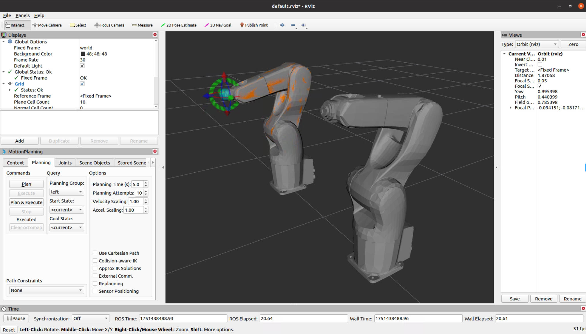

# Dual DENSO VS068 Robot Control Setup Guide

This guide describes how to set up and control a dual-arm DENSO VS068 robot system using ROS and MoveIt, including robot description, controller configuration, joint state merging, and MoveIt integration.

---

## 1. Prepare Individual VS-068 Descriptions

Before proceeding, please refer to the official [denso_robot_ros Wiki](https://wiki.ros.org/denso_robot_ros) to set up the description packages for two VS-068 arms. Follow the instructions to generate two separate description packages:

- `vs068l_description` for the left arm
- `vs068r_description` for the right arm

These packages should each contain the necessary mesh files, URDF/Xacro files, and configuration files for a single VS-068 robot. This step ensures that both arms are properly described and ready for integration into the dual-arm system.

### 2.1.1. Update Joint Names for Consistency

When creating or modifying the description and configuration files, ensure that all joint names follow the convention:
- For the left arm: `vs068l_joint_1`, `vs068l_joint_2`, ..., `vs068l_joint_6`
- For the right arm: `vs068r_joint_1`, `vs068r_joint_2`, ..., `vs068r_joint_6`

**You must update any occurrence of the old generic names like `joint_1`, `joint_2`, etc., to the new names in the following files:**

- The robot description files (URDF/Xacro) in `vs068l_description` and `vs068r_description`
- The controller configuration files, e.g.:
  - `denso_robot_descriptions/vs068l_description/denso_robot_control.yaml`
  - `denso_robot_descriptions/vs068r_description/denso_robot_control.yaml`
  - `denso_robot_moveit_config/config/vs068r_config/controllers.yaml`
- The joint limits files, e.g.:
  - `denso_robot_moveit_config/config/vs068r_config/joint_limits.yaml`
- The SRDF files, e.g.:
  - `denso_robot_moveit_config/config/vs068r_config/vs068r.srdf`

**Example:**

If you see a line like this in a config file:
```yaml
joints: [joint_1, joint_2, joint_3, joint_4, joint_5, joint_6]
```
Change it to:
```yaml
joints: [vs068l_joint_1, vs068l_joint_2, vs068l_joint_3, vs068l_joint_4, vs068l_joint_5, vs068l_joint_6]
```
Or for the right arm:
```yaml
joints: [vs068r_joint_1, vs068r_joint_2, vs068r_joint_3, vs068r_joint_4, vs068r_joint_5, vs068r_joint_6]
```

Similarly, in SRDF files, change:
```xml
<joint name="joint_1" value="0" />
```
to:
```xml
<joint name="vs068l_joint_1" value="0" />
```
or
```xml
<joint name="vs068r_joint_1" value="0" />
```

> **Note:** This naming consistency is required for MoveIt and controller compatibility. All configuration and description files must use the correct joint names for each arm.

---


## 3. Dual-Arm URDF/Xacro

- The dual-arm robot is described in `dual_vs068/urdf/dual_vs068.urdf.xacro`.
- It includes both left and right arm descriptions and fixes them to the world frame with appropriate offsets.
- Example Xacro Inclusion

```xml
<!-- dual_vs068/urdf/dual_vs068.urdf.xacro -->
<robot name="dual_vs068" xmlns:xacro="http://ros.org/wiki/xacro">
  <xacro:include filename="$(find denso_robot_descriptions)/vs068l_description/vs068l.urdf.xacro"/>
  <xacro:include filename="$(find denso_robot_descriptions)/vs068r_description/vs068r.urdf.xacro"/>

  <link name="world"/>
  <joint name="world_to_left" type="fixed">
    <parent link="world" />
    <child link="vs068l_world" />
    <origin xyz="0 -0.45 0" rpy="0 0 0" />
  </joint>
  <joint name="world_to_right" type="fixed">
    <parent link="world" />
    <child link="vs068r_world" />
    <origin xyz="0 0.45 0" rpy="0 0 0" />
  </joint>
</robot>
```


---

## 4. Controller and Launch Configuration

### 4.1. Modified Launch: denso_robot_control_modify.launch

A new launch file `denso_robot_control_modify.launch` is provided in `denso_robot_control/launch/`.  
This file allows you to flexibly specify the robot's IP address, name, and other parameters, and loads all necessary description/configuration files for each arm.

<!-- **Usage Example:**
```xml
<include file="$(find denso_robot_control)/launch/denso_robot_control_modify.launch">
  <arg name="robot_name" value="vs068l" />
  <arg name="ip_address" value="10.240.48.66" />
</include>
``` -->
<!-- This launch file simplifies the process of bringing up each DENSO robot arm with custom parameters. -->

### 4.2. Dual Arm Bringup Launch

- The launch file `dual_vs068/launch/dual_vs068_bringup.launch` starts both arms, their controllers, and the joint state merger node.

```xml
<launch>
  <!-- IP and control parameters -->
  <arg name="left_ip" default="10.240.48.66" />
  <arg name="right_ip" default="10.240.48.96" />
  <!-- ... other args ... -->

  <!-- Load dual-arm robot description -->
  <param name="robot_description" command="$(find xacro)/xacro '$(find dual_vs068)/urdf/dual_vs068.urdf.xacro'" />

  <!-- Left arm bringup -->
  <param name="robot_name" value="vs068l"/>
  <include file="$(find denso_robot_control)/launch/denso_robot_control_modify.launch">
    <arg name="robot_name" value="vs068l" />
    <arg name="ip_address" value="$(arg left_ip)" />
    <!-- ... -->
  </include>
  <node name="controller_spawner_l" pkg="controller_manager" type="spawner" ns="vs068l" args="joint_state_controller arm_controller" />
  <node name="robot_state_publisher_left" pkg="robot_state_publisher" type="robot_state_publisher">
    <remap from="/joint_states" to="/vs068l/joint_states" />
  </node>

  <!-- Right arm bringup -->
  <param name="robot_name" value="vs068r"/>
  <include file="$(find denso_robot_control)/launch/denso_robot_control_modify.launch">
    <arg name="robot_name" value="vs068r" />
    <arg name="ip_address" value="$(arg right_ip)" />
    <!-- ... -->
  </include>
  <node name="controller_spawner_r" pkg="controller_manager" type="spawner" ns="vs068r" args="joint_state_controller arm_controller" />
  <node name="robot_state_publisher_right" pkg="robot_state_publisher" type="robot_state_publisher">
    <remap from="/joint_states" to="/vs068r/joint_states" />
  </node>

  <!-- Joint state merger node -->
  <node name="joint_states_merger_node" pkg="dual_vs068" type="merge_joint_states.py" output="screen"/>
</launch>
```

---

## 5. Joint State Merger Node

- The script `dual_vs068/scripts/merge_joint_states.py` merges joint states from both arms and republishes them on `/joint_states`.

```python
#!/usr/bin/env python
import rospy
from sensor_msgs.msg import JointState

# Initialize merged joint state
merged_state = JointState()
merged_state.name = []
merged_state.position = []
merged_state.velocity = []
merged_state.effort = []

def update_joint_state(msg, source):
    global merged_state
    for i, name in enumerate(msg.name):
        if name in merged_state.name:
            idx = merged_state.name.index(name)
            merged_state.position[idx] = msg.position[i]
            merged_state.velocity[idx] = msg.velocity[i]
            merged_state.effort[idx] = msg.effort[i]
        else:
            merged_state.name.append(name)
            merged_state.position.append(msg.position[i])
            merged_state.velocity.append(msg.velocity[i])
            merged_state.effort.append(msg.effort[i])

def callback_l(msg):
    update_joint_state(msg, 'l')

def callback_r(msg):
    update_joint_state(msg, 'r')

if __name__ == '__main__':
    rospy.init_node('joint_state_merger_node')
    rospy.Subscriber('/vs068l/joint_states', JointState, callback_l)
    rospy.Subscriber('/vs068r/joint_states', JointState, callback_r)
    pub = rospy.Publisher('/joint_states', JointState, queue_size=10)
    rate = rospy.Rate(50)
    while not rospy.is_shutdown():
        merged_state.header.stamp = rospy.Time.now()
        pub.publish(merged_state)
        rate.sleep()
```

> **Comment:** This node ensures that MoveIt and other nodes receive a unified joint state for both arms.

---

## 6. MoveIt Configuration

### 6.1. Build the MoveIt configuration by running: 
```bash
rosrun moveit_setup_assistant moveit_setup_assistant.
```
Then configure your MoveIt setup using the dual-arm URDF or Xacro file.

### 6.1. Controller Configuration

- The file `dual_vs068_moveit_config/config/ros_controllers.yaml` should define controllers for both arms:

```yaml
controller_list:
  - name: /vs068l/arm_controller
    action_ns: follow_joint_trajectory
    default: True
    type: FollowJointTrajectory
    joints:
      - vs068l_joint_1
      - vs068l_joint_2
      - vs068l_joint_3
      - vs068l_joint_4
      - vs068l_joint_5
      - vs068l_joint_6

  - name: /vs068r/arm_controller
    action_ns: follow_joint_trajectory
    default: False
    type: FollowJointTrajectory
    joints:
      - vs068r_joint_1
      - vs068r_joint_2
      - vs068r_joint_3
      - vs068r_joint_4
      - vs068r_joint_5
      - vs068r_joint_6
```

### 6.2. MoveIt Launch Setup

- Configure `dual_vs068_moveit_config/launch/dual_vs068_moveit.launch` to launch MoveIt for the dual-arm robot.

```xml
<launch>
  <!-- Load joint limits, kinematics, planning pipeline, etc -->
  <include file="$(find dual_vs068_moveit_config)/launch/planning_context.launch">
    <arg name="load_robot_description" value="false"/> 
  </include>

  <!-- Load controllers.yaml and joint limits -->
  <rosparam file="$(find dual_vs068_moveit_config)/config/ros_controllers.yaml" command="load" />

  <!-- Start MoveIt move_group node -->
  <include file="$(find dual_vs068_moveit_config)/launch/move_group.launch"/>


  <!-- RViz with MoveIt config -->
  <include file="$(find dual_vs068_moveit_config)/launch/moveit_rviz.launch">
    <!-- <arg name="config" value="true"/> -->
  </include>
  
</launch>

```

---

## 7. Running the Dual-Arm System

1. **Bring up both arms and the merger node:**
   ```bash
   roslaunch dual_vs068 dual_vs068_bringup.launch
   ```

2. **Start MoveIt for dual-arm planning:**
   ```bash
   roslaunch dual_vs068_moveit_config dual_vs068_moveit.launch
   ```

#### 7.1. One-Step Launch for Dual-Arm System

You can now launch both arms and MoveIt in a single step using the new launch file:

```bash
roslaunch dual_vs068 dual_vs068_full.launch
```
<!-- This launch file includes both the bringup and MoveIt launch files, making the process more convenient. -->

---

## 8. Notes

- Ensure all IP addresses and parameters match your hardware setup.
- The joint state merger is essential for MoveIt to plan for both arms simultaneously.
- You can further customize the robot description, controller, and MoveIt configuration as needed.

---

## 9. References

- [Denso robot ros](https://wiki.ros.org/denso_robot_ros)

---

## 10. Example: Successful Launch Visualization

Below is a screenshot of a successful launch, showing both DENSO VS068 arms in RViz:


<!-- This image demonstrates the expected result after launching the dual-arm system. -->

---

This guide should help you or others in your team to set up and control a dual-arm DENSO VS068 robot system using ROS and MoveIt. If you need more details on any step, please refer to the corresponding files in the repository or ask for further clarification.